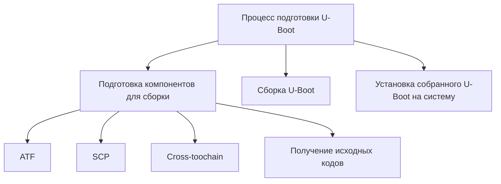

# Оглавление
- [Работа в командной строке в u-boot](#работа-в-командной-строке-в-u-boot)
	- [Подключение к debug-консоли](#подключение-к-отладочному-порту)
	- [Отключение watchdog](#отключение-watchdog)
- [Процесс подготовки U-Boot](#процесс-подготовки-u-boot)
	- [Подготовка компонентов для сборки](#подготовка-компонентов-для-сборки)
		- [Подготовка ATF (Arm Trusted Firmware)](#подготовка-atf-arm-trusted-firmware)
			- [Заимствование BL31 из собранного deb-пакета ATF](#заимствование-bl31-из-собранного-deb-пакета-atf)
			- [Самостоятельная сборка ATF](#самостоятельная-сборка-atf)
		- [Установка cross-toolchain](#установка-cross-toolchain)
		- [Получение исходных кодов](#получение-исходных-кодов)
	- [Сборка u-boot](#сборка-u-boot)
	- [Установка u-boot](#установка-u-boot)
		- [Установка на emmc (внутреннюю флеш-память)](#установка-на-emmc-внутреннюю-флеш-память)
		- [Установка на MicroSD](#установка-на-microsd)
		- [Очистка ENV-переменных](#очистка-env-переменных)
			- [Очистка из под хостовой системы](#очистка-из-под-хостовой-системы)
			- [Очистка из под загруженного u-boot](#очистка-из-под-загруженного-u-boot)
- [Создание конфигурации u-boot](#создание-конфигурации-u-boot)
- [Создание варианта платы](#создание-варианта-платы)
- [Логика работы ENV-скриптов при загрузке u-boot](#логика-работы-env-скриптов-при-загрузке-u-boot)


В этом документе описан процесс работы с загрузчиком и самостоятельная сборка и установка загрузчика [u-boot](https://docs.u-boot.org/en/latest/) для контроллера [WirenBoard 8.5](https://wirenboard.com/wiki/Wiren_Board_8.5).
Описание рассчитано на начальные навыки работы с ОС Linux.
Также описана логика работы скриптов, выполняемых при загрузке u-boot для поддержки собранной системы с помощью Buildroot и системы обновления RAUC,  

[Buildroot](https://buildroot.org/downloads/manual/manual.html) - это инструмент для создания минимальной операционной системы для встроенных устройств. 

[**RAUC**](https://rauc.readthedocs.io/en/latest/) — это система обновления прошивки для встроенных устройств. Она помогает безопасно обновлять программное обеспечение и предотвращает поломки устройства при неудачных обновлениях.

---
# Работа в командной строке в u-boot
## Подключение к отладочному порту
Работа с командной строкой u-boot происходит через отладочный порт. 
Процесс подключения к отладочному порту подробно описан в [этой статье](https://wirenboard.com/wiki/Debug_Console)
## Отключение watchdog
Для работы командной строке u-boot необходимо отключить watchdog, так как он будет перезагружать систему каждые 60 секунд.
Это можно сделать нажав и удерживая кнопку B1 или запаяв перемычку Watchdog OFF. 
Подробности работы встроенного watchdog смотрите в [этой статье](https://wirenboard.com/wiki/Watchdog).


# Процесс подготовки U-Boot
Разбиение (декомпозиция) процесса подготовки на этапы в графическом виде:


---
## Подготовка компонентов для сборки

#### Для сборки u-boot необходимо подготовить следующие компоненты:
1. **ATF** (Arm Trusted Firmware) — управляет безопасностью и инициализацией системы. Нам нужен его ключевой компонент BL31 — он отвечает за запуск защищённой среды и передачу управления загрузчику u-boot.
2. **SCP** (System Control Processor) - нужен для управления системными ресурсами, такими как питание, тактовые частоты, переферия. Так как мы не используем эти функции в u-boot, то SCP просто отключаем при сборке.
3. **Cross-toolchain** - это специальный набор инструментов для сборки программ на одной платформе (например на AMD64), но с целью их выполнения на другой платформе (в нашем случае: на платформе WirenBoard с ARM-процессором).
4. **Исходные коды** - используется исходный код оригинального проекта u-boot с некоторыми правками: 
	- с поддержкой установленной оперативной памяти и периферии
	- настройками, позволяющими сразу иметь загрузчик подготовленный к работе на контроллере WirenBoard c поддержкой системы обновления RAUC.

### Подготовка ATF (Arm Trusted Firmware)
Для уменьшения работ проще использовать уже ранее собранный компонент BL31 из deb-пакета ATF из debian-based дистрибутива WirenBoard.
Также, ниже представлена последовательность шагов для самостоятельно сборки компонента BL31 (в составе пакета ATF), если необходимо внести какие-то изменения.

#### Заимствование BL31 из собранного deb-пакета ATF
Ниже представлены шаги, по извлечению компонента BL31 из ранее собранного deb-пакета для оригинальной платформы WirenBoard. Каких-то секретов внутри собранного пакета нет, но этот шаг существенно упрощает процесс подготовки.

1. Загрузить deb-пакет с собранным ATF:
	`wget http://deb.wirenboard.com/wb8/bullseye/pool/main/a/arm-trusted-firmware/arm-trusted-firmware_2.10.0%2bdfsg-1%2bwb2_arm64.deb`
		
	 Если данного пакета уже нет (из-за устаревания документации), то нужно сперва актуализировать версию (находясь на оригинальном контроллере WirenBoard) через:
	`apt-cache policy arm-trusted-firmware`
	и после посмотреть откуда и какой версии пакетный менеджер APT выкачивает данный пакет:
	`apt-get install -o Debug::Acquire::http=true arm-trusted-firmware`

2. Распаковать полученный deb-пакет:
	`dpkg-deb -x arm-trusted-firmware_2.10.0+dfsg-1+wb2_arm64.deb /tmp`

3. Скопировать компонент **BL31** в удобное место:
	`cp /tmp/usr/lib/arm-trusted-firmware/sun50i_h616_no_pmic/bl31.bin ~/`
	
4. Очистить мусор (будьте внимательны!):
	`rm -r /tmp/usr`

Подготовка компонента BL31 закончена.
Не удаляйте полученный файл ~/bl31.bin - он будет нужен для последующей компиляции u-boot!

#### Самостоятельная сборка ATF
Так как вы знаете зачем вам это нужно, то ниже представлена просто "шпаргалка" для сборки:
- `git clone [https://github.com/ARM-software/arm-trusted-firmware.git](https://github.com/ARM-software/arm-trusted-firmware.git)`
- `cd arm-trusted-firmware/`
- `export CROSS_COMPILE=aarch64-linux-gnu-`
- `make PLAT=sun50i_a64 DEBUG=0 bl31`
- `cp build/sun50i_a64/release/bl31.bin ~/bl31.bin`

### Установка cross-toolchain
Рекомендуется использовать cross-toolchain для системы ARM64, поставляемый с операционной системой.

Для ОС Ubuntu выполните (если не делали это ранее):
`sudo apt install git gcc-aarch64-linux-gnu` 


### Получение исходных кодов
1. Перейдите в директорию где будете вести работу по сборке.
   Например:
   `cd ~/wirenboard`
2. Склонируйте исходные коды из публичного репозитория (TODO: поправить УРЛ):
   `git clone git@github.com:wirenboard/u-boot-buildroot.git`
3. Перейдите внутрь полученной директории:
   `cd u-boot-buildroot`
4. Переключитесь на ветку buildroot:
   `git checkout buildroot`

Теперь вы имеете все подготовленные компоненты для сборки u-boot.


---
## Сборка u-boot
1. Экспортируем ранее подготовленные компоненты, чтобы сборщик u-boot мог использовать их: 
	- `export CROSS_COMPILE=aarch64-linux-gnu-`
	- `export BL31=~/bl31.bin`
	- `export SCP=/dev/null`
	, здесь если на предыдущем шаге вы разместили BL31 в какое-то другое место отличное от ~/bl31.bin, то необходимо указать его.
	SCP=/dev/null - так как мы не используем управление питанием в u-boot.
	
2. Конфигурируем u-boot с  подготовленным файлом конфигурации:
	- `make sun50i_wirenboard8_buildroot_defconfig`
	  
3. Компилируем u-boot:
	- `make -jXX`
	, здесь **XX** сколько процессоров/ядер на вашей машине (можно не указывать, но сборка будет происходить существенно дольше)

После завершения компиляции вы получете собранный образ u-boot, находящемуся в файле **u-boot-sunxi-with-spl.bin** в текущей директории.


---
## Установка u-boot
Возможно 2 варианта установки собранного u-boot:
1. Установка на emmc  (внутреннюю флеш-память)  - если вы хотите использовать свою сборку u-boot на постоянной основе (т.е. хотите заменить заводской загрузчик).
2. Установка на MicroSD - если вы хотите получить загрузочную MicroSD для тестирования собранного u-boot и пока не хотите заменять заводской загрузчик.

### Установка на emmc (внутреннюю флеш-память)
1. Отключите все питание от контроллера WirenBoard
2. Вставьте  специально подготовленную MicroSD в контроллер (TODO) 
2. Подключить контроллер WirenBoard кабелем USB к вашей системе. 
   После этого контроллер начнет загрузу. Дождитесь ее окончания.
4. После загрузки WirenBoard его внутренняя emmc будет "прокинута" в вашу систему в виде подключенного USB-Flash
5. Определите как называется полученный диск в вашей системе. (TODO)
   Здесь важно не перепутать, так как возможно нанести ущерб своей системе(!).
6. Скопируйте собранный загрузчик на контроллер:
   - `sudo dd if=u-boot-sunxi-with-spl.bin of=/dev/sdX bs=8k seek=1 status=progress`
	, здесь /dev/sdX заменить на диск определенный на предыдущем шаге.

### Установка на MicroSD
Создание загрузочной MicroSD с u-boot, не сильно отличается от предыдущего пункта.
1. Вставьте MicroSD в картритерд, а картридер в вашу систему
2. Определите как называется полученный диск в вашей системе. (TODO)
   Здесь важно не перепутать, так как возможно нанести ущерб своей системе(!).
3. Скопируйте собранный загрузчик на контроллер:
   - `sudo dd if=u-boot-sunxi-with-spl.bin of=/dev/sdX bs=8k seek=1 status=progress`
	, здесь /dev/sdX заменить на диск определенный на предыдущем шаге.

### Очистка ENV-переменных
Если вы повторно перепрошиваете u-boot (например при разработке), то желательно очистить сохраненные ENV-переменные. Особенно важно это делать, если вы изменяете логику работы встроенных скриптов u-boot!

Есть 2 способа очистки:
1. Очистка из под хостовой системы. Удобно сразу почистить env-переменные, когда вы обновляете загрузчик.
2. Очистка из под загруженного u-boot - если по какой-то причине вы не захотели воспользоваться первым вариантом.

#### Очистка из под хостовой системы
`dd что-то там` (TODO)

#### Очистка из под загруженного u-boot
1. Отключите все питание от контроллера
2. Соедините ваш компьютер и с контроллером с помощью USB-кабеля.
3. Запустите программу для подключения терминального эмулятора через последовательный порт.
   Например: `minicom -b 115200 -D /dev/ttyACM0`
   ,здесь /dev/ttyACM0 - serial-устройство, которое определилось системой 
4. Передерните (выключите-включите) кабель USB, чтобы перезагрузить контроллер
5. В момент приглашения u-boot прервите его загрузку нажав клавишу Space (пробел). Примечание: приглашение ограничено 2-мя секундами после включения, если вы не успели прервать загрузку, то повторите с шага 4.
6. Выполните команды в консоли u-boot:
	`env default -a ; saveenv`
7. Перезагрузите контроллер (если не хотите продолжать работу в консоли u-boot):
   `reset`


---
## Создание конфигурации u-boot
Сохраненные конфигурации хранятся в папке configs/
Чтобы иметь свою сохраненную конфигурацию u-boot-а, необходимо проделать следующие шаги:
1. Применить уже готовый конфиг-файл:
   `make sun50i_wirenboard8_buildroot_defconfig`
   будет создан файл .config 
2. Внести изменения в файл .config ручным редактированием или через `make menuconfig`
3. Сохранить полученные изменения в папку configs/
   например:
   `cp .config configs/sun50i_wirenboard8_custom_defconfig`
4. Теперь полученный конфиг можно применять с помощью:
   `make sun50i_wirenboard8_custom_defconfig`

---
## Создание варианта платы
Если необходимо изменить скрипты и/или переменные производителя, то можно их отредактировать в соответствующий файле, но лучшей практикой будет создать свою конфигурацию платы по подобию существующих.

Для этого необходимо проделать следующие действия:
1. Придумайте собственное название конфигурации (например: WB8_FLAVOUR_CUSTOM)
2. Добавьте придуманное название в файл **board/wirenboard/sun50i_wirenboard8/Kconfig**, как это сделано для WB8_FLAVOUR_BUILDROOT:
   
```
choice
prompt "WB8 flavour"

config WB8_FLAVOUR_GENERIC
    bool "Generic Wiren Board 8"

config WB8_FLAVOUR_BUILDROOT
    bool "Buildroot Wiren Board 8"
    
config WB8_FLAVOUR_CUSTOM
    bool "Buildroot Wiren Board 8 with my custom changes"

endchoice
```

2. Подключить условный include в файле **include/configs/sun50i_wirenboard8.h**:
```
#ifdef CONFIG_WB8_FLAVOUR_BUILDROOT
#include <configs/wirenboard_buildroot.h>
#elif defined(CONFIG_WB8_FLAVOUR_CUSTOM)
#include <configs/wirenboard_custom.h>
#else
#include <configs/wirenboard_common.h>
#endif   
``` 

3. Сделайте копию файла с скриптами и ENV-переменными include/configs/wirenboard_buildroot.h:
   `cp include/configs/wirenboard_buildroot.h include/configs/wirenboard_custom.h`
4. Внесите в созданный файл **include/configs/wirenboard_custom.h** необходимые изменения.
5. Создайте файл конфигурации u-boot, в которой в качестве варианта платы будет выбран данный CONFIG_WB8_FLAVOUR_CUSTOM. 

## Логика работы ENV-скриптов при загрузке u-boot
Для упрощения понимая работы скриптов загрузки, представленных в файле **include/configs/wirenboard_buildroot.h**, создана схема:

```mermaid
stateDiagram
  direction TB
  state BootInProgress <<choice>>
  state CheckFWReset {
    direction TB
    state CheckButtonPress <<choice>>

    [*] --> CheckButtonPress:<b>Кнопка сброса нажата?</b> <br> run check_button?
    Beep --> CheckButtonPress2
    CheckButtonPress --> Beep:TRUE
    state CheckButtonPressAgain <<choice>>

    CheckButtonPress2 --> CheckButtonPressAgain:<b>Кнопка сброса нажата?</b> <br> run check_button?
    FactoryReset --> [*]
    CheckButtonPress --> [*]:FALSE
    CheckButtonPressAgain --> [*]:FALSE
    CheckButtonPressAgain --> s5:TRUE
    s5 --> FactoryReset
    CheckButtonPress
[*]    Beep
    CheckButtonPress2
    CheckButtonPressAgain
    FactoryReset
[*]    s5
  }
  state MarkSlotFailed {
    direction TB
    state CheckSlotA <<choice>>

    [*] --> CheckSlotA:<b>Текущий слот A?</b><br>rauc_slot == A
    MarkSlotAFailed --> SaveEnv
    MarkSlotBFailed --> SaveEnv
    CheckSlotA --> MarkSlotAFailed
    CheckSlotA --> MarkSlotBFailed
    SaveEnv --> [*]
    CheckSlotA
[*]    MarkSlotAFailed
    SaveEnv
    MarkSlotBFailed
[*]  }
  state CheckCurrentSlotFailed {
    direction TB
    state IsSlotAFailed <<choice>>

    [*] --> IsSlotAFailed:<b>Это слот A и он поломан?</b> <br> rauc_slot == A AND SLOT_A_FAILED == 1?
    state IsSlotBFailed <<choice>>

    IsSlotAFailed --> IsSlotBFailed:FALSE<br> <b>Это слот B и он поломан?</b> <br> rauc_slot == B AND SLOT_B_FAILED == 1?
    IsSlotBFailed --> [*]:FALSE
    IsSlotAFailed --> s1:TRUE
    IsSlotBFailed --> s1:TRUE
    s1 --> [*]
    IsSlotAFailed
[*]    IsSlotBFailed
[*]    s1
  }
  state CheckBothSlotFailed {
    direction TB
    state s2 <<choice>>

    [*] --> s2:<b>Флаги поломанности выставленны у обоих слотов?</b> <br> SLOT_A_FAILED == 1 AND SLOT_B_FAILED == 1
    s2 --> s3:TRUE
    s2 --> [*]:FALSE
    s3 --> s4
    s4 --> [*]
    s2
[*]    s3
[*]    s4
  }
  state ChooseRootFS {
    direction TB
    state SlotA <<choice>>

    [*] --> SlotA:<b>Текущий слот A?</b><br> rauc_slot == A?
    SlotA --> SetRootA
    SlotA --> SetRootB
    SetRootA --> [*]
    SetRootB --> [*]
    SlotA
[*]    SetRootA
    SetRootB
[*]  }
  state TryBoot {
    direction TB
    state TryBootScript <<choice>>

    [*] --> TryBootScript:Получилось прочитать boot.scr?
    state ExecuteBootScript <<choice>>

    TryBootScript --> ExecuteBootScript:TRUE<br>Получилось исполнить boot.scr?
    ExecuteBootScript --> Fallback:FALSE
    ExecuteBootScript --> BootKernel:TRUE
    TryBootScript --> BootKernel:FALSE
    BootKernel --> Fallback
    state Fallback {
      direction TB
      [*] --> SwitchSlot
      SwitchSlot --> s14
[*]      SwitchSlot
      s14
    }
    state BootKernel {
      direction TB
      state s8 <<choice>>

      LoadFDT --> s8:Загрузка FDT успешна?
      s8 --> [*]:FALSE
      state LoadKernel <<choice>>

      s8 --> LoadKernel:Получилось прочитать ядро с ФС?
      LoadKernel --> [*]:FALSE
      state runKernel <<choice>>

      runKernel --> [*]:FALSE
      LoadKernel --> runKernel:Удалось запустить ядро?
      [*] --> s13
      s13 --> LoadFDT
      state LoadFDT {
        direction TB
        state s6 <<choice>>

        [*] --> s6:Получилось загрузить FactoryDeviceTree?
        state s7 <<choice>>

        s6 --> s7:TRUE<br>Там есть имя специфического DeviceTree?
        s6 --> LoadDefaultDT:FALSE
        LoadDefaultDT --> [*]
        s7 --> LoadDefaultDT:FALSE
        s7 --> s11
        s11 --> [*]
        state LoadDefaultDT {
          direction TB
          [*] --> s10
          s10 --> [*]
[*]          s10
[*]        }
      }
    }
  }
  [*] --> MMC
  MMC --> CheckFWReset
  CheckFWReset --> BootInProgress:<b>Система пыталась загружаться ранее?</b>  boot_in_progress == 1?
  BootInProgress --> MarkSlotFailed:TRUE
  MarkSlotFailed --> CheckBothSlotFailed
  BootInProgress --> CheckBothSlotFailed:FALSE
  CheckBothSlotFailed --> CheckCurrentSlotFailed
  CheckCurrentSlotFailed --> ChooseRootFS
  ChooseRootFS --> TryBoot
  CheckFWReset:<b>Проверка кнопки сброса прошивки</b> <br> check_fw_reset
  Beep:Запуск звуковой обратной связи
  CheckButtonPress2:Ожидание повторной проверки через 5 секунд
  FactoryReset:Инициализация заводского сброса
  s5:Запуск звуковой обратной связи
  MarkSlotFailed:<b>Помечаю текущий слот поломанным</b> <br> mark_current_slot_failed
  MarkSlotAFailed:Помечаю слот A как поломанный
  SaveEnv:Сохраняю изменения<br>
  MarkSlotBFailed:Помечаю слот B как поломанный
  CheckCurrentSlotFailed:Проверка поломки текущего слота
  s1:Смена текущего слота<br>
  CheckBothSlotFailed:<b>Проверяю поломанность обоих слотов</b> <br> check_both_failed
  s3:Сбрасываю флаги поломанности и переключаюсь на первый слот
  s4:Сохраняю изменения
  ChooseRootFS:<b>Установка корневой файловой системы</b> <br> choose_rootfs
  SetRootA:Настройка rootfs для слота A
  SetRootB:Настройка rootfs для слота B
  TryBoot:<b>Попытка загрузиться с текущими настройками</b><br>attempt_boot_script
  Fallback:<b>Попытка загрузиться с другим слотом</b><br>retry_boot_on_other_slot
  BootKernel:<b>Запуск linux</b><br>boot_linux
  SwitchSlot:Уведомляю пользователя об неуспешной попытке
  s14:<b>Перезагружаюсь</b> <br> reset
  LoadFDT:<b>Загрузка FDT</b><br>load_fdt_with_overlays
  s13:<b>Устанавливаю флаг попытки запуска linux</b> <br> boot_in_progress=1
  LoadDefaultDT:<b>Загрузка DeviceTree по-умолчанию</b><br>load_default_dt
  s11:Загрузить специфический DeviceTree
  s10:Загрузить DeviceTree по-умолчанию
  MMC:Устанавливаю текущий emmc и пересканирую его
```




